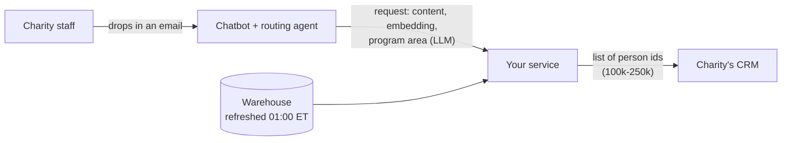

# Donor targeting: Senior ML Engineer take-home

A large charity sends email appeals to about 250,000 subscribers, and every email costs it
subscribers. Our data science team has built a model that predicts who will donate to a given
email. **Your job is to get that model into production**: a service that, a few minutes after a
charity staff member drops an email into our chatbot, sends their CRM the list of people who
should receive it.

Everything you need is in this repo, plus a synthetic copy of the charity's data warehouse that
`make data` downloads.

- [Background](#background)
- [The existing work](#the-existing-work)
- [The product](#the-product)
- [Your task](#your-task)
- [Getting started](#getting-started)
- [How we measure your list](#how-we-measure-your-list)
- [Submitting](#submitting)
- [FAQ](#faq)

## Background

- The charity emails its list twice a week (Tuesdays and Thursdays). Each email covers one of
  **12 program areas**: clean water, disaster relief, education, and so on.
- **The business-as-usual (BAU) rule** is to send each email to a **random 75%** of the active
  list. Nobody targets anything.
- **Every email causes churn.** Between 1% and 2% of recipients unsubscribe from each email (1.5%
  on average), and an unsubscribed person can never be emailed again. In the six months of
  history in this repo the charity lost **145,000 subscribers** to unsubscribes and only kept
  its list size up by signing up about 5,000 new people a week.
- **The business goal is to reduce churn by not sending unnecessary emails**, without giving up
  the donations the emails bring in (about 1.1% of emails lead to a gift; the median gift is
  $45).

## The existing work

The data science team found that **people donate to content that looks like what they have
recently engaged with**:

1. For a send of email *c* to person *p*, take the content *p* opened or clicked in the 30 days
   before the send, and average its embeddings. This is `centroid_1m`, the person's recent
   taste.
2. The cosine similarity between `centroid_1m` and *c*'s embedding is
   `centroid_cosine_similarity`. It is NULL when *p* engaged with nothing in the last 30 days.
3. A logistic regression on that one feature (plus a was-NULL indicator) predicts whether the
   send leads to a donation. Out-of-time ROC AUC is 0.63.

The code is `donor_targeting/features.py` (features for a 60k-send sample),
`donor_targeting/ml_harness.py` (takes `X` and `y` DataFrames and returns a fitted model,
metrics and predictions) and `donor_targeting/train.py` (writes `models/donation_model.joblib`
and a model card).

`donor_targeting/baseline.py` replays targeting rules on historical sends. History was sent to
a random 75%, so it is an unbiased sample of the list. For each email, keep a share of its
recipients and count the donors and unsubscribes you would still get (`make baseline`):

| policy | emailed | precision (donation rate) | recall (donors reached) | $ recall | unsubscribes caused |
|---|---:|---:|---:|---:|---:|
| send to everyone | 100% | 1.15% | 100% | 100% | 100% |
| **BAU: random 75%** | 75% | 1.15% | 75.0% | 75.0% | 75.0% |
| engaged in last 30 days | 74.9% | 1.22% | 79.7% | 79.6% | 73.8% |
| centroid top 75% | 75% | 1.24% | 81.0% | 81.2% | 73.6% |
| **centroid top 50%** | 50% | 1.51% | 65.8% | 63.7% | 43.1% |
| centroid top 25% | 25% | 2.18% | 47.2% | 46.0% | 19.8% |

For example, sending each email to the top half of the list by centroid similarity reaches 88%
of the donors BAU reaches while causing 43% fewer unsubscribes. Where to draw the line is a
business decision; the model only tells you the order.

**This works offline, on a 60,000-send sample, in a notebook-sized batch job. Nobody has run it
in production.**

## The product



1. A staff member at the charity drops the email they want to send into our chatbot.
2. A routing agent (already built; assume it works) embeds the content with the same model
   that produced `content.dense_embedding`, has an LLM classify its `program_area`, and calls
   your service with a request like `examples/requests/2003_clean_water.json`:

   ```json
   {
     "request_id": "req_2003",
     "org_id": "demo-charity",
     "requested_at": "2026-09-01T16:00:00+00:00",
     "content": {
       "content_id": 2003,
       "subject": "Meet Amara — a clean water story",
       "program_area": "clean_water",
       "dense_embedding": [-0.024415, -0.037156, "... 1024 floats"]
     },
     "audience": {"type": "all_active_subscribers"},
     "destination": {"crm": "mock", "list_name": "clean_water appeal (2003)"}
   }
   ```

3. **Within 3 minutes of the request**, the list of people who should get the email must be
   in the CRM. That is typically **100,000 to 250,000 people**.

### Constraints

| | |
|---|---|
| Latency | The complete list is in the CRM within **3 minutes** of the request. |
| Scale | 100k–250k people per list; several staff members may send requests on the same day. |
| Hardware | A **Render background worker with 2 GB of RAM and 4 CPUs**. The 2 GB is a hard limit. |
| Data | The warehouse is refreshed **every night at 01:00 ET**. Staff start using the product at **09:00 ET**. |
| CRM | The whole list goes to the CRM in a single request, which takes about 2 seconds (`donor_targeting/mocks/crm.py`). |

## Your task

**Build and deploy an API that receives the routing agent's request and meets the business
goal: the right list, in the CRM, within 3 minutes, on the hardware above.**

- **Serve the request.** Accept the request above (you design the response and any status
  endpoint), decide the audience, and push it to the CRM.
- **Meet the business goal.** Decide who should *not* get the email. Tell us how you traded off
  donations against churn and why.
- **Deploy it.** Give us one command that runs your service locally the way it would run on
  Render (for example `docker compose up` with `--memory=2g --cpus=4`, or a `make` target).
  A real deployment is welcome but not required.
- **Mock anything you need.** The CRM, the warehouse, the routing agent, Render. Mocks for the
  first two are in `donor_targeting/mocks/`, and `data/requests/` has 12 requests to replay.
- **Think about what data to persist**, where, and why.
- **Include your AI sessions** if you used AI tools (please do): see `ai_sessions/README.md`.

### What to hand in

1. Your code.
2. A `DESIGN.md` of two or three pages covering:
   - the architecture, and what happens at request time versus ahead of time;
   - the memory and latency budget for a 250k-person request, with numbers;
   - how you choose the audience, and your estimate of the donations it keeps and the
     unsubscribes it avoids compared with BAU;
   - what you persist and why;
   - what can go wrong in production and what your service does about it;
   - how you would know it works once it is live;
   - what you would do next with more time.
3. Evidence that it meets the constraints, such as the timing and peak memory of a 250k-person
   request.

### What we are looking for

**Critical thinking.** We care more about the quality of your decisions than the amount of
code. A small system with well-reasoned trade-offs beats a large one that doesn't know why
it's shaped the way it is. Push back on the brief where you think it is wrong. Plan on
**roughly 4–6 hours**. If you run out of time, write down what you would have done instead of
doing it.

## Getting started

You need [uv](https://docs.astral.sh/uv/getting-started/installation/), about 1 GB of free disk
and a machine with 8 GB or more of RAM.

```bash
make all    # install, download the warehouse (130 MB), features, model, baseline report
make test   # a few quick checks
```

| path | what |
|---|---|
| `DATA_DICTIONARY.md` | Tables, columns, refresh schedule, attribution rules. **Read this first.** |
| `donor_targeting/config.py` | Program areas, the snapshot time, paths. |
| `donor_targeting/features.py` | The DS team's feature pipeline (`centroid_1m`, `centroid_cosine_similarity`). |
| `donor_targeting/ml_harness.py` | `run(X, y)` returns a fitted model, holdout metrics and predictions. |
| `donor_targeting/train.py` | Trains the existing model into `models/`. |
| `donor_targeting/baseline.py` | Precision and recall of BAU against centroid targeting. |
| `donor_targeting/mocks/` | A mock CRM and the warehouse as DuckDB. |
| `examples/requests/` | A sample chatbot request. All 12 are in `data/requests/` after `make data`. |
| `ai_sessions/` | Where your AI transcripts go. |

`make data` downloads `data/warehouse/` (timeline, transactions, content, people) and
`data/requests/`. `make features` adds `data/warehouse/features.parquet`. Everyone works from
the same snapshot, so your numbers will match ours.

## How we measure your list

The data comes from a simulator, so for any list we know the donations and unsubscribes it would
produce in expectation. We replay the 12 requests in `data/requests/` against your service and
score each list it writes to the mock CRM against BAU's random 75%:

- **donations and dollars kept**: your list's expected donations and dollars, as a share of
  BAU's;
- **unsubscribes avoided**: the share of BAU's expected unsubscribes your list does not cause.

We also flag duplicate ids and people who are not on the active list.

The simulator is not part of this repo, and production has no oracle either, so estimate these
numbers the way you would for real. History went to a random 75% of the list, which makes
replaying a targeting rule on it an unbiased backtest; `donor_targeting/baseline.py` does this
for a few simple rules.

## Submitting

Email a zip of your work to [aaron@chorusai.co](mailto:aaron@chorusai.co), with `DESIGN.md` at
the root. Leave out `data/` and `.venv/`: we rebuild both with `make all`. In the follow-up
interview you will walk us through it and we will change a constraint or two to see how the
design holds up.

## FAQ

**Can I change or retrain the model?** Yes, if it serves the business goal and you explain why.
The main task is getting it into production, though, not squeezing out more AUC.
